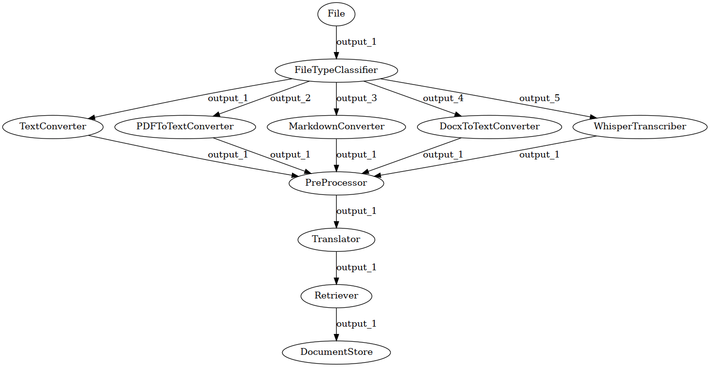
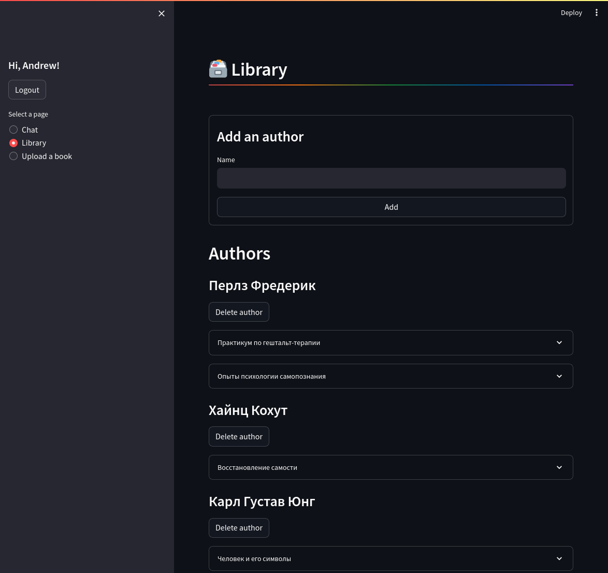

# Psychology Q&A

This project was built for the purpose of indexing a dataset of
psychology books and performing semantic search on them later.
However, it is not tailored for any specific field or data, so
you can easily use it for your personal needs.

You can upload `txt`, `pdf`, `md`, and `doc` files, but also
`mp3` audio, which will be transcribed by Whisper.

## Embedding models

This is a list of embedding models I've tried, along with my
feedback. I'd recommend using `intfloat/multilingual-e5-large`,
as it is both multilingual and supports asymmetric search.
More info on Sentence-BERT: [sbert.net](https://www.sbert.net/)

Ideally, you'd want to fine-tune the model to your data
to make the search more efficient.

| Name                                    | Embedding size | Languages    | Search type              | Link                                                                                                | Results                                                               |
| --------------------------------------- | -------------- | ------------ | ------------------------ | --------------------------------------------------------------------------------------------------- | --------------------------------------------------------------------- |
| `multilingual-e5-large`                 | 1024           | Multilingual | Symmetric and asymmetric | [huggingface 洟余(https://huggingface.co/intfloat/multilingual-e5-large)                              | 笨 Best of all, allows producing embeddings without translating text   |
| `multi-qa-mpnet-base-dot-v1`            | 768            | English-only | Asymetric                | [huggingface 洟余(https://huggingface.co/sentence-transformers/multi-qa-mpnet-base-dot-v1)            | 汨 Good, but requires translation                                      |
| `paraphrase-multilingual-MiniLM-L12-v2` | 384            | Multilingual | Symmetric                | [huggingface 洟余(https://huggingface.co/sentence-transformers/paraphrase-multilingual-MiniLM-L12-v2) | 汨 Only fits for symmetric search, but does not require translation    |
| `all-mpnet-base-v2`                     | 768            | English-only | Symmetric                | [huggingface 洟余(https://huggingface.co/sentence-transformers/all-mpnet-base-v2)                     | 泅ｫ Bad, requires translation and is only suitable for symmetric search |

## Database setup

Add `pgvector` extension before creating tables:

```sql
CREATE EXTENSION vector;
```

## Pipelines

Querying and data-processing pipelines are built on top of
[Haystack](https://haystack.deepset.ai/). Many of the nodes
used are either built or extended by me.

> Note that Translator is an optional node and
> can be disabled in `.app.env`

<details>
    <summary>Processing pipeline diagram generated by <code>farm-haystack</code></summary>
    
</details>

<details>
    <summary>Querying pipeline diagram generated by <code>farm-haystack</code></summary>
    <blockquote></blockquote>
    
</details>

## Screenshots

   

## To Do

- [x] Authentication
- [x] Show source of answer on chat page
- [ ] Gather feedback on answers to fine-tune model later
- [ ] Allow revealing more text after receiving answer
- [ ] Add filters (by book, author, language) on querying page
- [ ] Don't show answers that are close to each other or are partial duplicates
- [ ] Persist answers between sessions (?)
